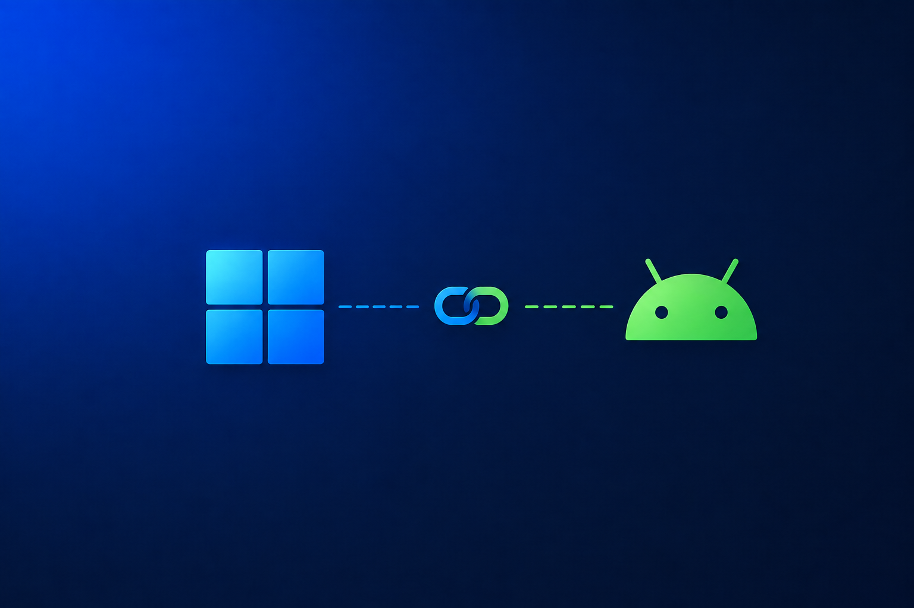

# WinBridge — Windows ↔ Android Köprüsü

Bilgisayarınız ve telefonunuz tek bir makine gibi. İki ekranı da karşılıklı
yansıtın — sesle ve dokunmatik kontrolle —, dosya ve panoyu iki yönde taşıyın,
ses ve mikrofonları aralarında yönlendirin, bilgisayarda çalışan otomasyonlar
kurun: telefondan, saatten, bir widget'tan ya da sesinizle.

🇬🇧 [English README](README.md)

> **Durum:** [v0.3.0](../../releases/latest). Aşağıdaki
> [neler gerçekten çalıştırıldı](#neler-gerçekten-çalıştırıldı) bölümüne bakın —
> bu sürüm büyük, ve iki makine ile kronometre gerektiren kısımlar dürüstçe
> ayrıca belirtildi.



---

## Neler yapıyor

### Ekranlar

- **Bilgisayar ekranı telefonda**: dokunmatik kontrol, klavye, kaydırma,
  parmakla yakınlaştırma ve yanında bilgisayar sesi.
- **Telefon ekranı bilgisayarda**: fare, klavye ve gezinme tuşları — yanında
  telefon sesiyle.
- İkisi de kendini ayarlar: önce kalite, sonra kare hızı, sonra çözünürlük,
  *alıcının* bildirdiğine göre aşağı iner. Yani görüntü, izleyenin en az
  rahatsız olduğu sırayla bozulur.
- Etkileşim ve ses, oturum sürerken ayrı ayrı açılıp kapatılabilir.

### Pano

- Telefon → bilgisayar ve bilgisayar → telefon, **ikisi de varsayılan kapalı**;
  her yönün *iki* cihazda da ayrı anahtarı var. Panonun "gelmemesinin" en sık
  nedeni birinin açık, diğerinin kapalı olmasıdır; artık iki taraf da sessizce
  atmak yerine bunu söylüyor.
- Kopyalamalar anında gönderilir. Android 10'dan beri panoyu yalnızca odaktaki
  pencerenin sahibi uygulama okuyabildiği için telefon sırayla dener: doğrudan
  okuma (WinBridge öndeyken bedava), "diğer uygulamaların üzerinde göster" izni
  verilmişse bir piksellik odak penceresi, sonra aktarıcı ekran. Ayarlar ekranı
  o telefonda hangi basamağın yanıt verdiğini söyler.
- Hızlı Ayarlar döşemesi, kısayol, saat, paylaşım menüsü ve Windows tepsi
  menüsündeki **Panoyu telefondan al** ile de erişilebilir.

### Dosyalar

- İki yönde, her boyutta; ilerleme, kaldığı yerden devam ve sağlama toplamı ile.
- Windows Gezgini'nde **sağ tık → "Telefona gönder"** (dosya ve klasör).
- Telefonda her şey için **paylaşım menüsü**.
- Gelen dosyalar İndirilenler'e iner; diğer tüm uygulamalar görebilir.

### Ses

- Bilgisayar sesi → telefon
- Telefon sesi → bilgisayar
- Telefon mikrofonu → bilgisayar
- Bilgisayar mikrofonu → telefon

Ham PCM: sesle görüntü arasında kodlama/çözme gecikmesi yok.

### Otomasyonlar

Telefonda kurun, bilgisayarda çalışsın. Kabuk komutları, pencereler, süreçler,
dosyalar, HTTP, girdi, medya, güç — `if`/`else`, `while`, `repeat`, `foreach`,
değişkenler ve bir ifade diliyle.

Güvenlik sonradan eklenmiş bir katman değil, tasarımın kendisi:

- Kabuk adımları, bilgisayarda uyarının önünde açılana kadar hiçbir şey yapmaz.
- Onay, çalıştırılabilir gövdenin hash'ine bağlıdır — ad değişirse korunur,
  komutta tek karakter değişirse iptal olur.
- Onay diyaloğu, komut satırını **değişkenler yerine konduktan sonra** gösterir.
- Çalışmalar adım, döngü, çıktı ve süre olarak sınırlıdır.
- Her çalışma, yalnızca eklenebilen bir denetim dosyasına yazılır.
- Tek bir anahtar her şeyi reddeder.

Ayrıntı: [docs/AUTOMATIONS.md](docs/AUTOMATIONS.md)

### Bildirimler

Telefon bildirimleri bilgisayara yansır; yanıtlama ve kapatma dahil.
**Varsayılan kapalı** — telefondaki her bildirimi okur, bu yüzden açmak iki
bilinçli adım gerektirir.

### Ses komutları ve asistanlar

Gemini veya Asistan'ın üçüncü parti bir uygulamaya serbest metin komut
iletmesini sağlayan herkese açık bir on-device API **yok** — dolayısıyla bu
entegrasyon kimse tarafından, API anahtarıyla ya da anahtarsız, kurulamaz.
WinBridge bunun yerine şunları sunuyor: otomasyonların başlatıcı kısayolu olarak
yayınlanması, cihazın kendi tanıyıcısını kullanan yerel bir sesli komut
eşleştiricisi, Tasker ve benzerleri için belgelenmiş bir intent API'si, ve
"bilgisayar ekranında ne var" sorusunun Windows tarafında OCR ile yanıtlanıp
sesli okunması.

Dürüst ve tam açıklama: [docs/ASSISTANT.md](docs/ASSISTANT.md)

### 0.1.x'ten gelenler

Gerçek bir Android medya oturumu olarak "şimdi çalıyor",
CPU/GPU/RAM/ağ/pil, ses düzeyi, güç işlemleri, altı ana ekran widget'ı —
yerleştirirken tek bir otomasyona bağladığınız **otomasyon düğmesi** dahil — ve
Wear OS uygulaması.

### Wear OS

Medya ve sistem durumuna **ek olarak**: otomasyon çalıştırma, bilgisayar için
touchpad, sesli komut, "bilgisayar ekranında ne var" yanıtının bilekte okunması
ve pano düğmesi. Üç döşeme.

Otomasyonlar saatte *yazılmaz* — bir adım ağacını kimse 45 mm ekranda düzenlemez
— ama üç yoldan çalıştırılabilir: uygulamanın kendi listesi, saat kadranından bir
kaydırma uzaktaki otomasyon döşemesi ve kadranın üzerine yerleştirilen, her yuva
için ayrı seçilen bir **komplikasyon**; böylece sürekli çalıştırdığınız rutin
sıfır dokunuş uzağınızda olur.

---

## Bağlantı

| Yöntem | Ne zaman | Not |
|---|---|---|
| **LAN (TCP)** | 0.2.0'dan itibaren varsayılan | Her şey çalışır |
| **Bluetooth (RFCOMM)** | İsteğe bağlı | Varlık, medya, kontrol, bildirim |
| **Uzaktan** | Portu yönlendirirseniz | Kanal uçtan uca şifreli |

**Bluetooth 0.2.0'dan itibaren varsayılan kapalı**; mevcut kurulumlar bir kez
taşınır. Varlık ve kontrol için hâlâ doğru taşıyıcı — Wi-Fi olmadan çalışır ve
telefon ağdan çıkınca ayakta kalır — ama kabaca bir megabit taşır; yansıtma, ses
ve kayda değer boyutta dosya oraya sığmaz. Bu akışlar Bluetooth üzerinde
bozulmuş görünecek şekilde yavaşlatılmak yerine, **gerekçesiyle reddedilir**.

Bir yöntemle eşleştirin, diğeri otomatik olarak kurulur.

---

## Kurulum

### Windows

1. [Releases](../../releases) sayfasından `WinBridge-Setup-x.y.z.exe` indirin.
2. Çalıştırın. Yönetici hakkı gerekmez.
3. Sistem tepsisinde yaşar, oturum açtığınızda başlar.

> **SmartScreen uyarısı:** kurulum dosyası imzasız (kod imzalama sertifikaları
> ücretli ve kimlik doğrulamalı bir üründür). "Diğer bilgiler" → "Yine de
> çalıştır" seçin.

### Android

1. Aynı sayfadan `app-release.apk` kurun.
2. Uygulamayı açıp kurulum sihirbazını izleyin.
3. Windows tepsi menüsünden **Eşleştir**'i seçip QR kodu okutun.

İki Android izni koddan istenemez, Android ayarlarından verilmelidir. Uygulama
bunların durumunu ilgili anahtarın yanında gösterir:

- **Erişilebilirlik** — yalnızca bilgisayarın telefonu kontrol etmesi için
  gerekir. Root olmadan kendi uygulamamız dışında dokunmanın ve yazmanın tek
  yolu budur.
- **Bildirim erişimi** — yalnızca bildirim yansıtma için gerekir.

**Bluetooth isterseniz:** önce telefonu Windows Ayarları'ndan normal şekilde
eşleştirin, sonra WinBridge'de iki tarafta da açın. Bu adım programatik olarak
yapılamaz; her iki işletim sisteminin de gereğidir.

### Wear OS saat

Ayrı APK (`wear-release.apk`), aynı anahtarla imzalı:

```bash
adb connect <saat-ip>:5555
adb -s <saat-ip>:5555 install wear-release.apk
```

---

## Güvenlik

- Eşleştirme, QR kodla iletilen 32 baytlık bir ön paylaşımlı anahtar üretir;
  bu anahtar **ağdan hiç geçmez**.
- Her oturum ayrıca geçici bir ECDH (P-256) anahtarı türetir; ön paylaşımlı
  anahtar sızsa bile kaydedilmiş trafik sonradan çözülemez.
- Tüm trafik AES-256-GCM, karşılıklı kimlik doğrulama ve tekrar koruması ile.
- Zaten paylaştığınız şeyi okuyanlar dışında her yeni özellik **varsayılan
  kapalı**.
- Otomasyon intent API'si varsayılan kapalı ve anahtarla korumalı — gizi olmayan
  dışa açık bir alıcı, kurduğunuz herhangi bir uygulamanın bilgisayarınızda
  komut çalıştırmasının yoludur.

Ayrıntı: [docs/PROTOCOL.md](docs/PROTOCOL.md)

---

## Neler gerçekten çalıştırıldı

Bu sürüm büyük; test konusunda dürüstlük yeşil bir tikten daha değerli.

**Her derlemede otomatik testlerle doğrulanan**

- İki uygulamadaki telsiz protokolü, bilinen-cevap vektörleri ve 58 v2 mesajının
  her birinin doldurulmuş birer örneğiyle birbirine sabitlendi.
- Şerit önceliği: kontrol çerçeveleri, biriken toplu trafiği geçiyor.
- Medya paketleri sınırsız kuyruğa alınmak yerine düşürülüyor.
- Pano parmak izi, iki dilde de aynı vektöre sabitlendi.
- `WinBridge.exe --selftest-capture out.png` gerçek bir ekran karesini döşeme
  kodlayıcısı ve paket biçimi üzerinden yeniden birleştiriyor.
- `WinBridge.exe --selftest-automation` bir otomasyonu gerçek kayıt yolundan
  kaydedip çalıştırıyor ve panonun gerçekten değiştiğini doğruluyor.
- Her iki uygulama ve host temiz derleniyor.

**Elle doğrulanan**

- v0.2.0 sürüm notlarında, fiziksel bilgisayar/telefon/saatte tam olarak neyin
  çalıştırıldığı ve neyin çalıştırılmadığı yazıyor.

Donanımınızda farklı davranırsa başlangıç noktası günlükler: Windows'ta
Etkinlik sekmesi, telefonda `adb logcat -s WinBridge`.

---

## Geliştirme

```bash
cd android && ./gradlew :app:assembleDebug :wear:assembleDebug
```

```bash
dotnet build windows/src/WinBridge.App/WinBridge.App.csproj
dotnet run --project windows/tests/WinBridge.Core.Tests
```

Gereksinimler: JDK 17+, Android SDK 36, .NET 10 SDK, Inno Setup 6 (kurulum).

- [docs/ARCHITECTURE.md](docs/ARCHITECTURE.md) — kararlar ve gerekçeleri
- [docs/PROTOCOL.md](docs/PROTOCOL.md) — telsiz biçimi
- [docs/AUTOMATIONS.md](docs/AUTOMATIONS.md) — adımlar, ifadeler, güvenlik
- [docs/ASSISTANT.md](docs/ASSISTANT.md) — ses, kısayollar, intent API

---

## Lisans

MIT
